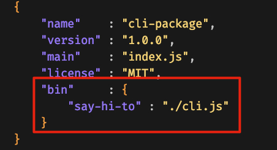

### how to npm cli

1) Add `bin` section to your `package.json`.   
Have a look at [cli.js](https://github.com/flndr/npm-cli-package-example/blob/master/packages/cli-package/cli.js) for more details!

2) Call it.   

